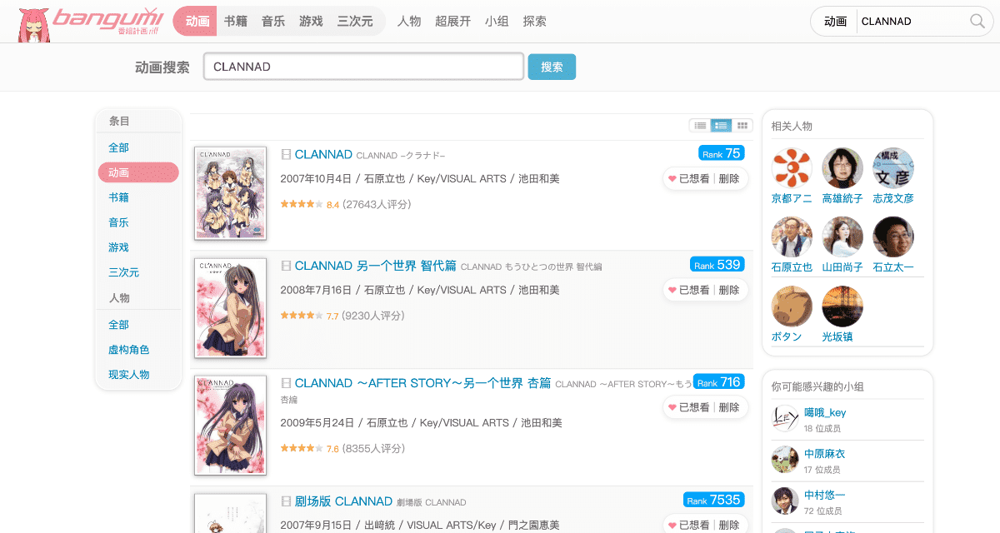
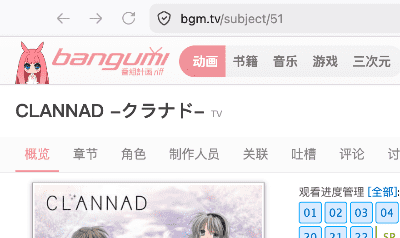

# 快速指南

如果你是一般用户，阅读完快速指南即可使用，无须额外修改配置。  
要修改配置来获得其他功能，请阅读 [docs/config.md](config.md)。

## 拉取动画

程序启动后，访问 `http://127.0.0.1:12500/` 打开 WebUI。  
你应该会看到空白的页面，这是因为目前还没有拉取数据。

### 获取动画 ID

要拉取数据，你需要先知道动画对应的 `ID`，这是“番组计划”中为每个项目分配的唯一 ID，在 Seshat 中也使用它来识别动画。

访问“[番组计划](https://bgm.tv/)”，在右上角的搜索框中输入你想查询的动画名称，然后点击搜索。  
此处以《CLANNAD》为例，点击左侧“条目”边栏的“动画”，然后点进你需要的条目中。  
查看浏览器地址栏，上面的 `51` 就是这部动画的 ID。

### 在 Seshat 拉取数据

进入 Seshat WebUI，点击右上角的“管理数据”按钮，在弹窗的“拉取动画”输入框中输入 `51`，然后点击右侧对钩。

程序将拉取这部动画的：

- 动画详情，以及动画海报
- 剧集列表
- 出演角色、制作人员列表，以及每位角色或人物的图片

在界面右下角，可以看到当前的拉取进度。根据网络环境，需要几秒到一分钟左右。  
拉取成功后，在主页就能看到这部动画的海报了。

“管理数据”弹窗中的其他功能，在本文末尾讲述。

## 动画、角色、人物

### 动画详情

点击动画海报，可以进入动画的详情页。这个页面展示了动画的简介、基本信息、剧集、标签、主要角色、关联条目，以及海报。  
如果你之前就是“番组计划”的用户，应该对这个界面不陌生～

点击某个标签，可以查看这个标签下的所有动画。点击顶栏的标签，可以查看本地收录的全部标签。

对于详情页的“关联条目”，Seshat 不会主动拉取他们的信息。  
因为 Seshat 设计为仅拉取用户明确指定的条目。

在评分卡片的上面，可以切换到剧集、角色、制作人员的详细列表。  
点击相关角色或人物，可以跳转到他们的详情页面。

### 角色和人物详情

这两个页面共享一套样式，会显示简介、基本信息、海报。  
对于角色，会展示 ta 出演过的动画以及 CV。对于人物，会展示 ta 出演过哪部动画的什么角色，以及参与制作的条目。

另外，点击顶栏的角色或人物按钮，可以查看本地收录的全部内容。

## 搜索

点击顶栏的搜索按钮，即可进入搜索页面。  
搜索时，后端会遍历本地储存的所有数据，来匹配你输入的内容（是的没有用索引，因为不太准确）。

## 评分

这是 Seshat 的功能，完全在本地运行。由于我不怎么会打 10 分制的分数，所以做了这个。
当你拉取了超过 2 部动画，就能对动画进行评分。

评分规则为标准的 ELO 机制，初始均为 1500 分。  
每次评分，系统会随机派发两部动画，你需要选出你认为更好的一部。

打分越多，统计越准确。最终的统计可以在“统计”页面查看。

## 统计

在条目统计中，记录你本地存放的每个分类的条目条数。

在评分统计中，默认按照 ELO 分数排序，没有分数的将不会展示。  
你可以在标题旁边的排序和显示设置中，选择你喜欢的方式来展示数据。

在 ELO 分数旁边的百分比，是程序根据这个条目在本地所有的 ELO 分数中计算的排名位置。

## 设置

默认状态下，页面右上角应当是一个动态的彩虹色方块。点击它，然后点击设置，将进入设置页面。  
设置页面动态读取主目录的 `preferences` 文件，请勿手动修改它。

你可以选择标题优先展示的方式，对于前端的大部分页面，都支持这个修改。  
默认为原文优先，即大标题为原文，副标题为中文。设置为中文优先可以交替两个标题的位置。

如果你有“番组计划”的账号，在“番组计划ID”输入框中输入它。  
Seshat 将可以展示你的收藏状态，拉取你的收藏列表等。  
设置了 ID 后，需要在管理数据中刷新用户数据。

## Tracker

这是一个追踪列表功能，可以让你方便的维护你的条目列表。

点击页面右上角的管理数据，在“拉取或创建 Tracker”输入框中，输入一个名字，然后点击对钩。  
当输入了一个不存在的 Tracker 名称，Seshat 会为你创建它。（如果已经存在，会拉取这个 Tracker 中记录的条目）

你可以在主目录的 `/tracker` 目录中找到创建的 Tracker 配置，配置文件为 `toml` 格式。  
在对应 Tracker 的 `.toml` 中的 `id` 字段中，以逗号分隔，填写进去你想要的 ID 即可。

## 管理数据

在管理数据弹窗中，“拉取动画”能够让你手动指定一个动画，并获取详细信息。  
使用逗号分隔，可以一次性拉取多个动画。  
被你明确指定要拉取的动画，会存放在主目录的 `/tracker/_seshat.json` 文件中。  
是的，你手动指定拉取的内容，也会被视为一个 Tracker。

### 拉取缺失

Seshat 会先扫描本地的所有数据，然后检查他们是否不完整。如果获取到了之前没有的内容，将会下载。  
然后，会扫描本地数据和所有 Tracker，计算条目差值，并拉取新增的条目。

如果只需要下载新增的几个条目，建议新建 Tracker 或者手动拉取。

### 刷新全部

Seshat 会根据本地的所有 Tracker 条目，拉取数据，然后直接覆盖本地的旧数据。  
对于本地存在，但这次拉取时没有获取到的数据，Seshat 也不会删除。

### 用户数据

刷新用户数据，用于从“番组计划”下载你的头像、基本信息、收藏夹。  
每次下载都会覆盖本地已有的内容。

导入收藏至 Tracker，用于将你的收藏列表导入到 Tracker。  
导入之后，就可以使用“拉取缺失”等功能，批量拉取这些数据了。

### 危险区

对于正常使用而言，不建议点击这里的内容。

重建索引，这会读取本地储存的 Json 数据，然后重新建立 index 目录下的内容。图像索引不会被重建。
重建 ELO，这会根据本地储存的 ELO 对战历史，重新计算 ELO 评分。
重建全部，这会删除主目录下的 `/data` 目录，然后根据 Tracker 中的条目完整重建。（不会影响 ELO 评分）

## 其他

Seshat 设计为“动画”的离线数据浏览工具。  
但是由于“番组计划”中的游戏、音乐、书籍等，均为一个“条目”。所以你也可以在 Seshat 中拉取这些内容。  
Seshat 前端也将尝试渲染它们。
